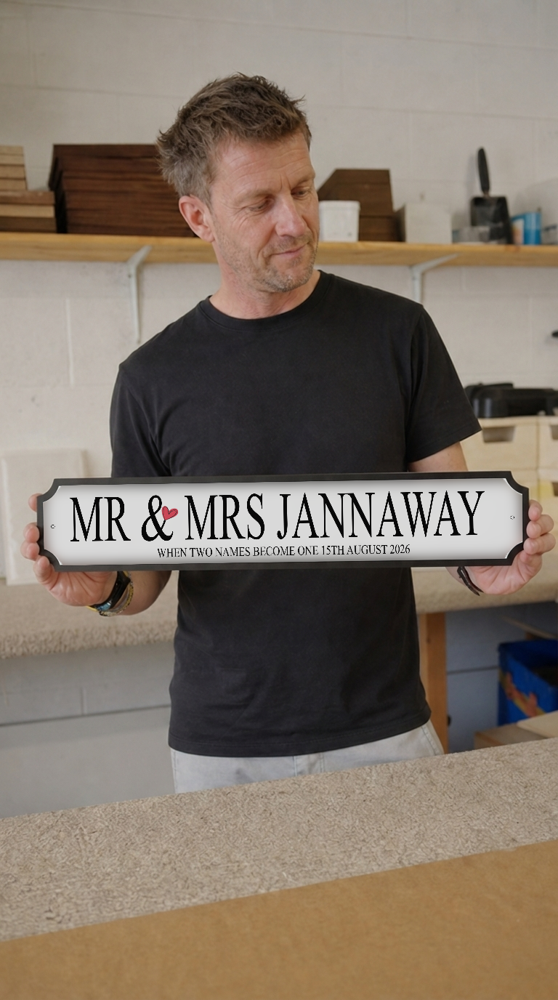
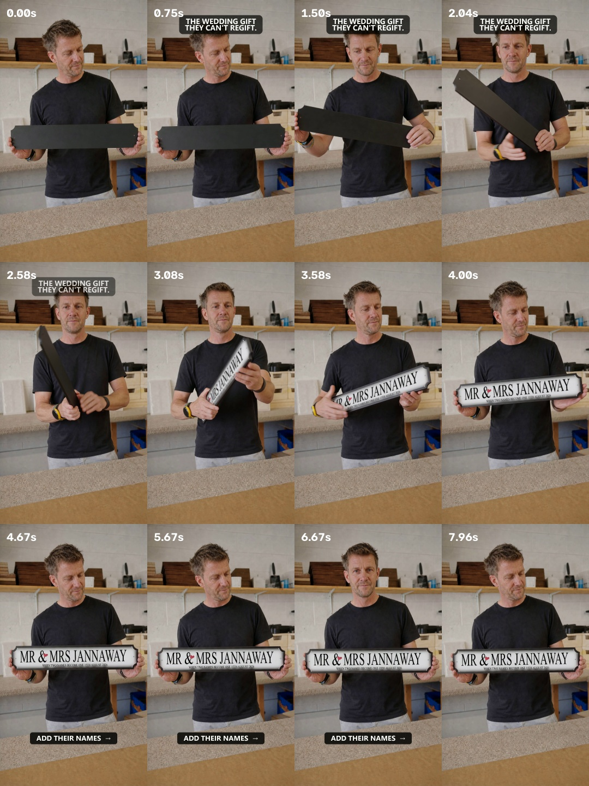
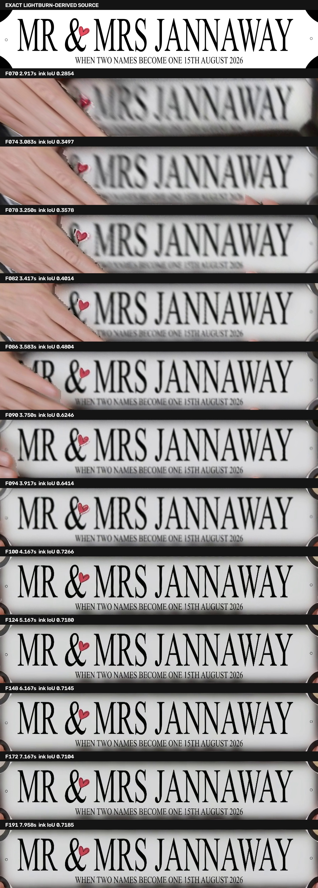

# Rejected street-sign case: DM-C017 Jannaway

Status: **rejected failure case; not a recipe; not published.**

This record is retained because it exposes a workflow fault that automated
lettering and continuity checks missed.

## Intended result

- Large Daisy Maison Mr & Mrs sign, 570 × 125 mm.
- `MR & MRS JANNAWAY`
- `WHEN TWO NAMES BECOME ONE 15TH AUGUST 2026`
- eight seconds, 24 fps, one continuous 180° reveal;
- hook: `THE WEDDING GIFT / THEY CAN'T REGIFT.`;
- CTA: `ADD THEIR NAMES →`.

The demand-backed idea and exact SVG/PDF remain valid. The visual production
does not.

## Rejected visual evidence

The low-cost generated still:

The invalid local exact-face composite later used as a video reference:

The rejected finished Reel:

The old lettering comparison demonstrates why source-pixel checks were not
enough:

## Fatal fault map

| Fault | What happened | Why humans reject it | Permanent fix |
| --- | --- | --- | --- |
| Invalid video source | The canonical face was pasted over take 08 and that composite was sent to Seedance | The model began from a graphic/object mismatch rather than one real-looking sign | Generate the exact SVG as a coherent physical sign image and require human approval before video |
| Missing edge truth | No real back-to-edge or front-to-edge references were supplied | Seedance invented a plaque far thicker than the real product | Require both transition/thickness views before video spend |
| Missing reverse truth | No real back view was supplied | Seedance invented a black reverse; Daisy Maison signs are white on the back | Require a real white-back reference |
| Forbidden final overlay | Frames 70–191 received a tracked whole-face replacement | The replacement white and border are visibly different; reflections, falloff, blur and shadows do not match | Never alter the product surface after generation; reject/regenerate the native video |
| False confidence from QC | OCR/source mapping and no-hard-cut checks passed | Those metrics tested text and motion, not whether the object looked physically real | Human normal-speed product-realism review is a mandatory acceptance gate |

## Generation record

Historical prompt filenames:

- [`successful-still-prompt.txt`](successful-still-prompt.txt)
- [`successful-video-prompt.txt`](successful-video-prompt.txt)

The filenames predate Max's rejection and do not confer successful status.

- Still model: Higgsfield Nano Banana 2, 1K, 9:16, three references.
- Selected still job: `48d7a48b-f7dd-4205-9345-bed2775b1d04`.
- Valid still spend: 9 credits for six takes.
- Video model: Seedance 2.0 Standard, 1080p High, 9:16, eight seconds,
  generated audio off, multi-shot off.
- Video job: `7d7f3cb6-13ce-4721-bcc1-fc0d369de561`.
- Video spend: 72 credits.
- Malformed wrapper-job spend: 9 credits.
- Known total: 90 credits.

## Useful finding retained

The Windows `higgsfield.cmd` wrapper truncated the prompt and dropped media
references. Calling the bundled native `vendor\hf.exe`, flattening the prompt,
quoting cost and inspecting returned job JSON fixed parameter delivery.

That connection fix did not solve physical product truth.

## Rules created from this failure

1. No video from a composited sign still.
2. Human approval of the exact coherent sign image is required first.
3. Printed front, back-to-edge, front-to-edge and white-back references are
   mandatory.
4. Thin profile and white reverse are locked product truths.
5. No product-surface overlay, including lettering-only correction.
6. Native product failure means reject and regenerate.
7. Hook/CTA/sound may be added only outside the sign.
8. Automated QC cannot overrule a human “this looks pasted on” decision.

See `../../../../WEDDING_SIGN_VIDEO_RULES.md` for the canonical production rule.
