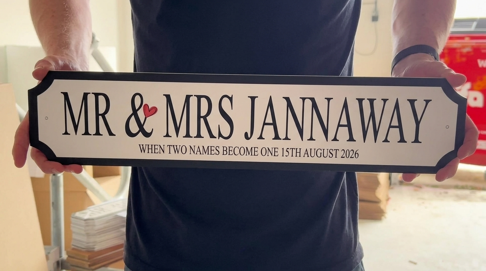
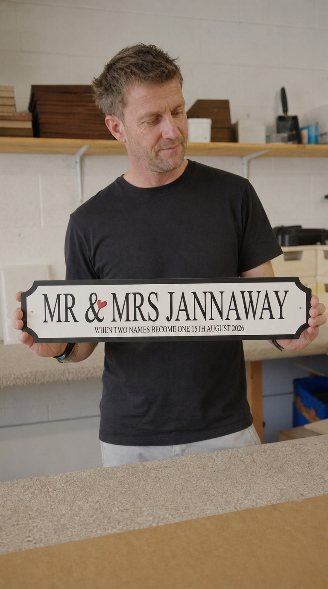
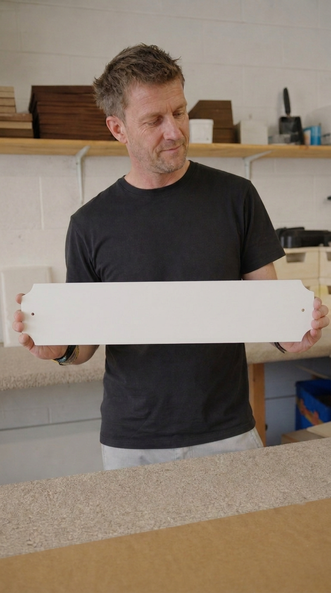
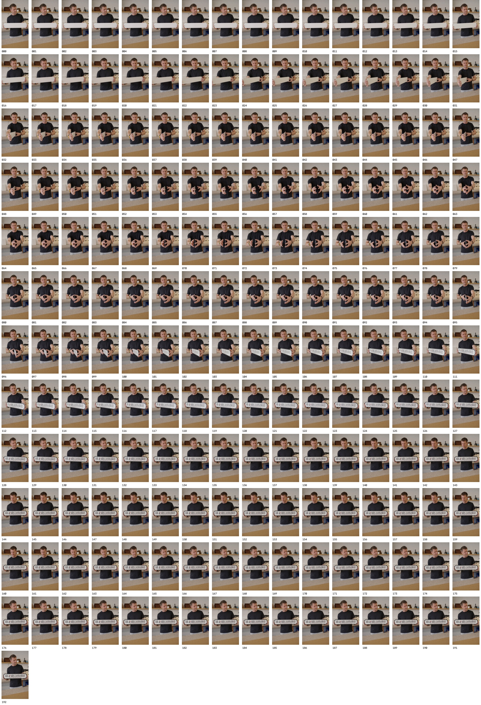
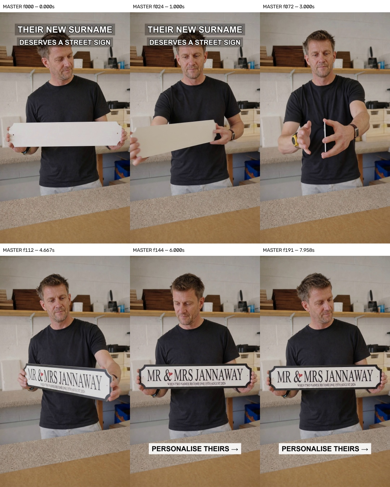

# Validated case: DM-C017 Jannaway v03

Status: **complete human-validated engineering proof; not published.**

Max watched the untouched native video on 23 July 2026 and rated it **8.5/10**
for realism. He approved documenting the workflow as the engineering method
for white wedding-sign outputs. It does not validate coloured signs, coloured
lettering or non-wedding products.

## Result

- Eight seconds.
- 1080 × 1920.
- 24 fps, 192-frame finished master.
- One continuous monotonic 180° back-to-front turn.
- Plain-white reverse.
- Thin pale physical edge.
- Exact Jannaway front.
- 3.375 seconds of frame-by-frame verified readable face.
- Hook, CTA and original sound outside the sign.
- No product-surface overlay at any stage.

## Validated evidence

Approved coherent product:

Approved synthetic-Max endpoint:

Approved matched white-back start:

All 193 untouched native frames:

Finished master checkpoints:

## Prompts

- [`01-validated-product-print-edit.txt`](01-validated-product-print-edit.txt)
- [`02-validated-synthetic-max-hero.txt`](02-validated-synthetic-max-hero.txt)
- [`03-validated-white-back-start.txt`](03-validated-white-back-start.txt)
- [`04-validated-native-video.txt`](04-validated-native-video.txt)

## Fault line and fix

| Fault line | Validated fix |
| --- | --- |
| Flat SVG was treated as the whole physical product | Lock one real Daisy sign as the manufactured-object master; SVG changes printing only |
| Exact face was pasted into a still | Human approves one untouched native product image |
| Max and product truth were solved in one overloaded prompt | Approve product first, then add synthetic Max while product remains locked |
| Back and thickness were invented | Build a matched white-back endpoint and supply real front-edge, back-edge and back views |
| Another performer could influence identity | Privacy-crop the real turn to sign/hands/torso mechanics only |
| Video prompt/reference delivery was unreliable | Call native `vendor\hf.exe`, quote first and inspect returned job JSON |
| Product was corrected after generation | Never patch it; reject native failure |
| OCR passed a visually fake object | Human normal-speed realism approval is a mandatory gate |

## Jobs and cost

| Stage | Jobs | Credits |
| --- | ---: | ---: |
| Approved product batch | 4 × Nano Banana 2 | 6 |
| Approved hero batch | 4 × Nano Banana 2 | 6 |
| Approved white-back batch | 4 × Nano Banana 2 | 6 |
| Native video | 1 × Seedance 2.0 | 72 |
| **Validated method total** |  | **90** |

Native video job:
`bf94cfac-e34f-4da7-8922-6cfc8322b1fc`.

## Reusable implementation

The full method, settings, gates, automation boundary and next-wedding-sign replacement
map live in
[`../../../../WEDDING_SIGN_ENGINEERING_PROMPT_WORKFLOW.md`](../../../../WEDDING_SIGN_ENGINEERING_PROMPT_WORKFLOW.md).

The earlier v02 overlay failure remains in [`CASE.md`](CASE.md) as a rejected
learning case. It is not the source for this validated result.
